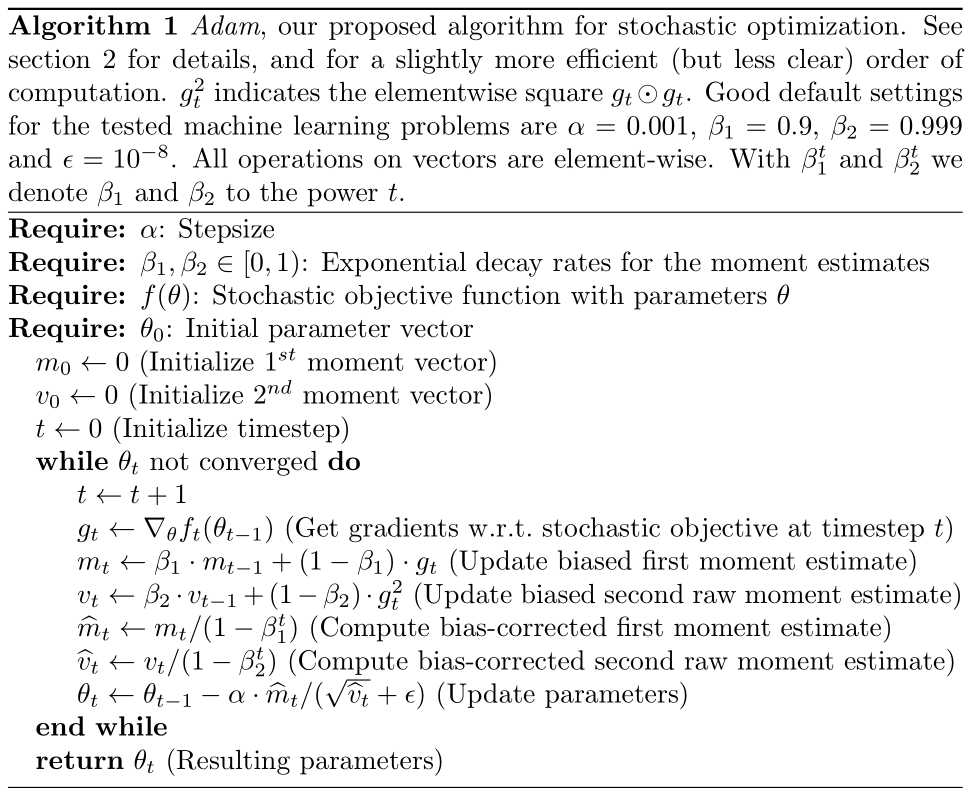

# My Adam

Adam is a very popular algorithm for first-order gradient-based optimization.
This project implements Adam in PyTorch for study purposes.



## Run

```sh
uv venv --seed --python=3.10
uv pip install torch numpy
source .venv/bin/activate
python test.py
```